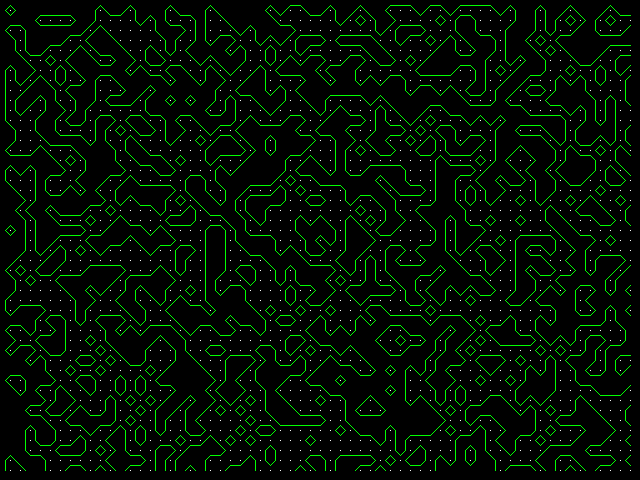
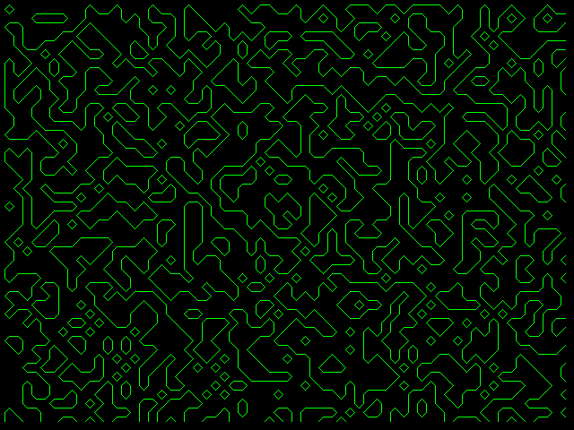

# Marching Squares 
## [Goal] Implement Marching Squares using OpenCV in C++
- Randomly generated grid image \
  

## 1. Prerequisites
### 1.1 Dependencies
OpenCV 3.2.0, C++ 11 version

### 1.2. OpenCV Installation
Follow [OpenCV](https://docs.opencv.org/4.x/d2/de6/tutorial_py_setup_in_ubuntu.html)
- Install appropriate OpenCV version: [Here](https://sungjaeshin.github.io/O/opencv-install/).

## 2. Changing Parameters
### Parameters in "parameters.h"
```
// For making interval of grid in image
#define DIFF_X 10
#define DIFF_Y 10
```

## 3. Build and Run 
Clone the repository and build and run simultaneously:
```
   $ cd ${workspace}
   $ git clone https://github.com/SungJaeShin/Marching_squares.git
   $ cd marching_squares
   $ sh start.sh
```

## 4. Setting Rules between Vertices and Edges !!
```
  p0           a           p1
     ○ ㅡㅡㅡㅡㅡㅡㅡㅡㅡㅡㅡ ○
     |                   |
     |                   |
  d  |                   |   b
     |                   |
     |                   |
     |                   |
     ○ ㅡㅡㅡㅡㅡㅡㅡㅡㅡㅡㅡ ○
 p3            c           p2

    {p0, p1, p2, p3} = {0, 0, 1, 0} <-----> {a, b, c, d} = {0, 1, 1, 0}

    // Not Make Any Line
    {0, 0, 0, 0} <-----> {0, 0, 0, 0} = 0
    {1, 1, 1, 1} <-----> {0, 0, 0, 0} = 0

    // Make Horizontal & Vertical Line
    {1, 1, 0, 0} <-----> {0, 1, 0, 1} = 5
    {0, 0, 1, 1} <-----> {0, 1, 0, 1} = 5
    {0, 1, 1, 0} <-----> {1, 0, 1, 0} = 10
    {1, 0, 0, 1} <-----> {1, 0, 1, 0} = 10

    // Make One Diagonal Line 
    {1, 0, 0, 0} <-----> {1, 0, 0, 1} = 9
    {0, 1, 1, 1} <-----> {1, 0, 0, 1} = 9
    {0, 1, 0, 0} <-----> {1, 1, 0, 0} = 12
    {1, 0, 1, 1} <-----> {1, 1, 0, 0} = 12
    {0, 0, 1, 0} <-----> {0, 1, 1, 0} = 6
    {1, 1, 0, 1} <-----> {0, 1, 1, 0} = 6
    {0, 0, 0, 1} <-----> {0, 0, 1, 1} = 3
    {1, 1, 1, 0} <-----> {0, 0, 1, 1} = 3

    // Make Two Diagonal Line
    p0          a           p1              p0          a           p1
        ● ㅡ ● ㅡㅡㅡㅡㅡㅡ ○                      ○ ㅡㅡㅡㅡㅡ ● ㅡㅡㅡ ●
        |  /             |                      |           \     |
        | /              |                      ●            \    |
    d   |/               ●   b              d   | \           \   |   b
        ●               /|                      |  \           \  |
        |              / |                      |   \             ●
        |             /  |                      |    \            |
        ○ ㅡㅡㅡㅡㅡㅡ ● ㅡ ●                      ● ㅡㅡ ● ㅡㅡㅡㅡㅡㅡ ○
    p3          c           p2              p3          c           p2

    {0, 1, 0, 1} <-----> {1, 1, 1, 1} = 15
    {1, 0, 1, 0} <-----> {1, 1, 1, 1} = 16
```

## 5. Results 
<table>
    <tr>
       <td> Result w/ vertices  </td>
       <td> Result w/o vertices </td>
    </tr>
    <tr>
       <td> </td>
       <td> </td>
    </tr>
 </table>

## 6. References
[1] [https://bbtarzan12.github.io/Marching-Squares-Part-1/](https://bbtarzan12.github.io/Marching-Squares-Part-1/) 

